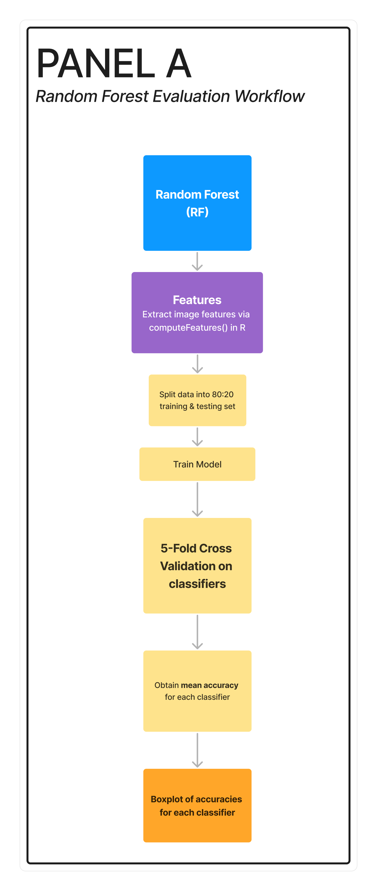
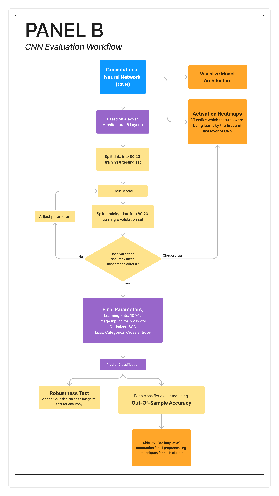
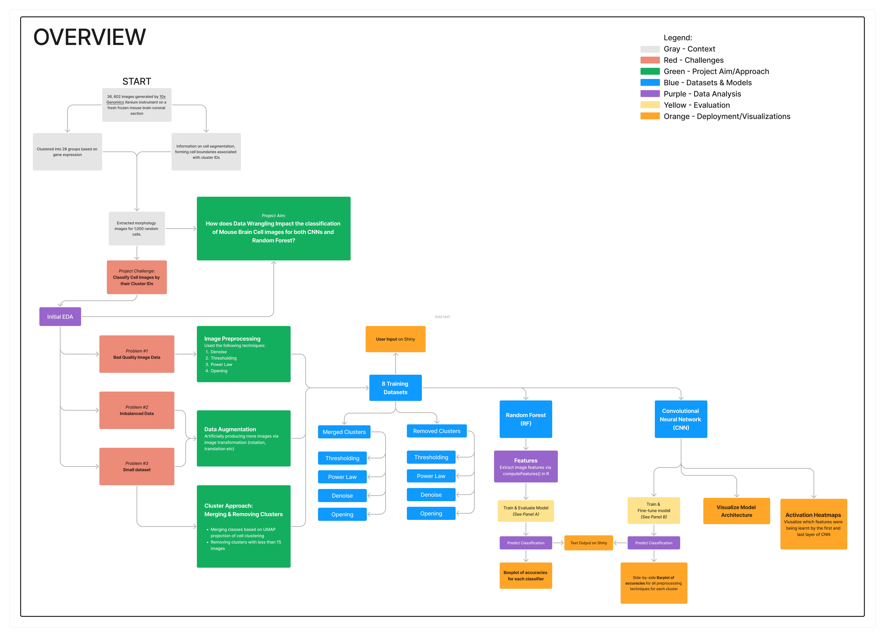

```{r setup, include=FALSE}
knitr::opts_chunk$set(echo = TRUE)
```

```{r, ouput = FALSE, warning=FALSE, message=FALSE}
library(SpatialPack)
library(tidyverse)
library(EBImage)
library(pracma)
library(randomForest)
library(ggimage)
library(ggplot2)
library(cowplot)

library(reticulate)
library(RBioFormats)
library(keras)
library(tensorflow)
tensorflow::set_random_seed(2023)
```


## Executive Summary 

**What is the problem?**

**The main findings**

**Key figures if needed**

**Practical relevance of the study**


## Background 

**ensure understanding of biotechnological data and platforms** 

## Aims

## Method 

**Add innovations for each aspect**
**ensure understanding of biotechnological data and platforms**
**can mention how rd pixels was added but scrapped and also how resnet was almost added but scrapped**
**add how each part is reproducible if neede**

### Data collection 


```{r}
# image output formatting
par(mfrow=c(2,3), mai=c(0.5, 0.5, 0, 1))

denoise_filter <- function(img){
  img = denoise(as.matrix(img), type="enhanced") 
  return(img)
}

power_filter <- function(img){
  img = img^2.5
  return(img)
}

thresholding_filter <- function(img){
  img = thresh(img, w=9, h=8, offset=0.05)
  img = fillHull(opening(img, makeBrush(5, shape='diamond')))
  return(img)
}

opening_filter <- function(img){
  img = opening(img, makeBrush(5, shape='diamond'))
  return(img)
}
# figure showing the preprocessing techniques
# orignial image
# threhoslded
# denoise
# power law 
# opening 
# with random noise 

img <- readImage("images/cell_338.png")
threshold_img = thresholding_filter(img)
denoise_img = denoise_filter(img)
opening_img = opening_filter(img)
power_img = power_filter(img)
EBImage::display(img, method = "raster")
text(x = 20, y = 150, label = "Original", adj = c(0,1), col = "orange", cex = 1.5)
EBImage::display(threshold_img, method = "raster")
text(x = 20, y = 150, label = "Threshold", adj = c(0,1), col = "orange", cex = 1.5)
EBImage::display(denoise_img, method = "raster")
text(x = 20, y = 150, label = "Denoise", adj = c(0,1), col = "orange", cex = 1.5)
EBImage::display(opening_img, method = "raster")
text(x = 20, y = 150, label = "Opening", adj = c(0,1), col = "orange", cex = 1.5)
EBImage::display(power_img, method = "raster")
text(x = 20, y = 150, label = "Power Law", adj = c(0,1), col = "orange", cex = 1.5)

noisy_img = imnoise(img, type = "gaussian", mean = 0, sd = 0.05, epsilon = 10, var = 10,
       looks = 1)
EBImage::display(noisy_img, method = "raster")
text(x = 20, y = 150, label = "Adding Noise", adj = c(0,1), col = "orange", cex = 1.5)
```

```{r}
# Load the image and preprocess it - same image for example 

img <- readImage("images/cell_338.png")

# original 
EBImage::display(img, method = "raster")

# denoise 
denoise_img = denoise(as.matrix(img), type="enhanced")

EBImage::display(denoise_img, method = "raster")

# thresholding 
thresholding_img = thresh(img, w=9, h=8, offset=0.05)
thresholding_img = fillHull(opening(thresholding_img, makeBrush(5, shape='diamond')))

EBImage::display(thresholding_img, method = "raster")

# opening 

opening_img = opening(img, makeBrush(5, shape='diamond'))

EBImage::display(opening_img, method = "raster")

# power law 
power_img = img^2.5

EBImage::display(power_img, method = "raster")

## dadding random noise 


```


### Developed Models
#### AlexNet
#### Random Forest 
### Evaluation Strategies 
#### Accuracy
#### Robustness
#### Interpretability 
#### qualitative to ensure communication 


## Results - Research Question 

### Performance 

#### Accuracy

```{r}
cnn_accuracies <- readRDS("CNN Accuracy Data.rds")
rf_cv_merged <- readRDS("Random Forest CV Merged Data.rds")
rf_cv_removed <- readRDS("Random Forest CV Removed Data.rds")

p <- ggplot(data = rf_cv_merged, aes(x = model, y = accuracy, fill = model)) + 
  geom_boxplot() + 
  geom_jitter(size = 1) + 
  #we apply title to every plot, not just fig
  labs(x = "Random Forest Model (Merged)", y = "5-fold CV Accuracy", fill = "Model/Dataset") +
  theme(axis.text.x = element_text(angle = 45, size = 3)) 
#ggplotly(p)

p2 <- ggplot(data = cnn_accuracies, aes(x = cnn_model_technique, y = accuracy, fill = data_type)) + 
  geom_bar(stat = 'identity', width = 0.7, position = position_dodge(width = 0.8)) + 
  theme(axis.text.x = element_text(angle = 45, size = 3)) +
  labs(fill = "Model/Dataset") + 
  xlab("CNN Model") + 
  ylab("Accuracy")
#ggplotly(p2)

p3 <- ggplot(data = rf_cv_removed, aes(x = model, y = accuracy, fill = model)) + 
  geom_boxplot(show.legend = FALSE) + 
  geom_jitter(size = 1) + 
  labs(x = "Random Forest Model (Removed)", y = "5-fold CV Accuracy", fill = "Model/Dataset") +
  theme(axis.text.x = element_text(angle = 45, size = 3)) 
#ggplotly(p3)

leg <- get_legend(
  p +
    guides(color = guide_legend(nrow = 1)) +
    theme(legend.position = "bottom")
)

#grid.arrange(p, p3, p2, ncol=2, nrow=2)
plot_grid(p3 + theme(legend.position="none"), p + theme(legend.position="right"), p2 + theme(legend.position="right"), labels = c("A", "B", "C"), vjust = 1)
```


#### Robustness
**also mention generality of findings**

```{r}
# this is where all the code will be added --
# for EVERYTHING 


# get the models to generate accuracies
# get the accuracies
# plot the graph 

# get the for the random forest model and explain how you can get the accruacies urself 
# plot these both side by side with panel a and panel b 

```


```{r}
# robustness test
# do a before and after with the test data with and without noise again 
# only get the values this time 
```

### Interpretability  
```{r}

# create model architecture with no weights - to load in models based on weights
create_model <- function(learning_rate = 0.000000000001, input_shape=c(224, 224, 1), cluster_number=17) {
  
  k_clear_session()
  
  model <- keras_model_sequential() %>%
    
    # 1st layer
    layer_conv_2d(filters = 96, kernel_size = c(11,11), strides = c(4,4), activation = 'relu', input_shape = input_shape, padding="same") %>% 
    layer_batch_normalization() %>%
    layer_max_pooling_2d(pool_size = c(3, 3), strides = c(2,2)) %>% 
    
    # 2nd layer
    layer_conv_2d(filters = 256, kernel_size = c(5,5), strides=c(1,1), activation = 'relu', padding = "same") %>% 
    layer_batch_normalization() %>%
    layer_max_pooling_2d(pool_size = c(3, 3), strides = c(2,2)) %>% 
    
    # 3rd layer
    layer_conv_2d(filters = 384, kernel_size = c(3,3), strides=c(1,1), activation = 'relu', padding = "same") %>% 
    layer_batch_normalization() %>%
    
    # 4th layer
    layer_conv_2d(filters = 384, kernel_size = c(3,3), strides=c(1,1), activation = 'relu', padding = "same") %>%
    layer_batch_normalization() %>%
    
    # 5th layer
    layer_conv_2d(filters = 256, kernel_size = c(3,3), strides=c(1,1), activation = 'relu', padding = "same") %>% 
    layer_batch_normalization() %>%
    layer_max_pooling_2d(pool_size = c(3, 3), strides = c(2,2)) %>% 
    
    # 6th layer
    layer_flatten() %>% 
    layer_dense(units = 4096, activation = 'relu') %>% 
    layer_dropout(rate = 0.5) %>% 
    
    # 7th layer
    layer_dense(units = 4096, activation = 'relu') %>%
    layer_dropout(rate = 0.5) %>%
    
    # 8th layer
    layer_dense(units = cluster_number, activation = 'softmax')
  
  model %>% compile(
    loss = "categorical_crossentropy",
    optimizer = optimizer_sgd(learning_rate = learning_rate),
    metrics = "accuracy"
  )
  
  return(model)
  
}

```


```{r, output = FALSE, ouput = FALSE, warning=FALSE, message=FALSE}

# load in example image
img <- readImage("images/cell_338.png")


img_resized = resize(img, 224, 224)
x_img <- array(dim=c(1, 224, 224, 1))


x_img[1,,,1] <- img_resized@.Data

input_shape = dim(x_img)[2:4]


# load in the saved and trained model 
# since the layers are the same for each model, we can use one example 
# will need to saev the cnn_models from the google drive link and save it in the same place
model = create_model(input_shape = input_shape)
loaded_model_cam = load_model_weights_hdf5(model, 'cnn_models/alexnet_merged_17_augmented_threshold_boundaries.h5')


# get layer outputs and create activation model based on the output layers

layer_outputs <- lapply(loaded_model_cam$layers[1:8], function(layer) layer$output)
activation_model <- keras_model(inputs = loaded_model_cam$input, outputs = layer_outputs)


# get weights based on prediction 
activations <- activation_model %>% predict(x_img)

# get the weights associated with a layer and channel 
first_layer_activation <- activations[[1]]

third_layer_activation <- activations[[3]]

last_layer_activation <- activations[[8]]


# function to plot the weights into an image 
plot_channel <- function(channel) {
  rotate <- function(x) t(apply(x, 2, rev))
  image(rotate(channel), axes = FALSE, asp = 1,
        col = terrain.colors(12))
}
```

```{r}
# orignal image 
img_resized = resize(img, 50, 50)
EBImage::display(img_resized, method = "raster")
```

```{r, figures-side, out.width="200%", fig.cap = "Activation Maps of Layers 1, 3 and 8 in AlexNet (Left to Right)"}

# layout plots in 2x2 format
par(mfrow=c(1,3))
# firs layer channel 70
plot_channel(first_layer_activation[1,,,70])
# third layer channel 7
plot_channel(third_layer_activation[1,,,96])
# last layer or 8th layer - channel 300
plot_channel(last_layer_activation[1,,,300])
```


## Results - Product 

### Clear description and illustration 

### concepts from multiple disciplines 

**add in the video maybe**

### evaluation metric for the app - feedback and interview session 

## Discussion 

### limitations 
### issues with development process
### issues with product

### Future work

### improvemtns in both discipline 

## Conclusion 


## add section explaining reprosucibiilty aspets
- download the data form the link
- get ac curacies of cnn, rf
- get robustness values of cnn and rf 
- get the cnn models from the google drive as well + the rf models
- get the augmented data from script
- get the techniques applied based on the script as well


## Student Contributions 

**Akasha**
**Thoon**
**Ian**
**James**
**George**
**Nikki**

## Appendix 





